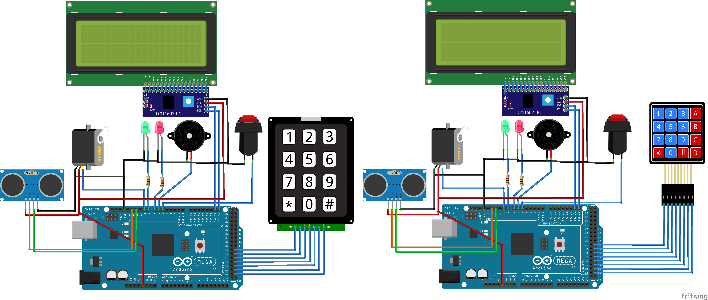

# ArduinoVaultPasscode

# 

## Table of contents

* [Libraries](#Libraries)
* [Pins](#Pins)
* [Tutorials](#Tutorials)

## Requirements

#### `Libraries`

* [**Countimer.h**: _This is simple timer and counter Arduino library_](https://github.com/inflop/Countimer)
* [**Keypad.h**: _Library for using matrix style keypads with the Arduino_](https://github.com/Chris--A/Keypad)
* [**Servo.h**: _This library allows an Arduino board to control RC (hobby) servo motors_](https://github.com/arduino-libraries/Servo)
* [**LiquidCrystal_I2C.h**: _The library allows to control I2C displays with functions extremely similar to LiquidCrystal library_](https://github.com/fdebrabander/Arduino-LiquidCrystal-I2C-library)

#### `Pins`

* SERVO_PIN			9
* GREEN_PIN			8
* RED_PIN				7
* BUZZER_PIN			6

//For Keypad 3x3
* R1					41
* R2					43
* R3					45
* R4					47
* C1					49
* C2					51
* C3					53

//For Keypad 3x4
* R1					39
* R2					41
* R3					43
* R4					45
* C1					47
* C2					49
* C3					51
* C4					53

Check the code and find this line
//Select only one keypad type
#define KEYPAD_4x4
//#define KEYPAD_3x4

#### `Tutorials`

* [**Keypad**: _Interface 4×3 & 4×4 Membrane Keypad with Arduino_](https://lastminuteengineers.com/arduino-keypad-tutorial/)
* [**Servo**: _How to control servo motor_](https://www.intorobotics.com/tutorial-how-to-control-the-tower-pro-sg90-servo-with-arduino-uno/)
* [**LiquidCrystal_I2C**: _How to Use I2C Serial LCD 20X4_](https://www.instructables.com/id/How-to-Use-I2C-Serial-LCD-20X4-Yellow-Backlight/)
